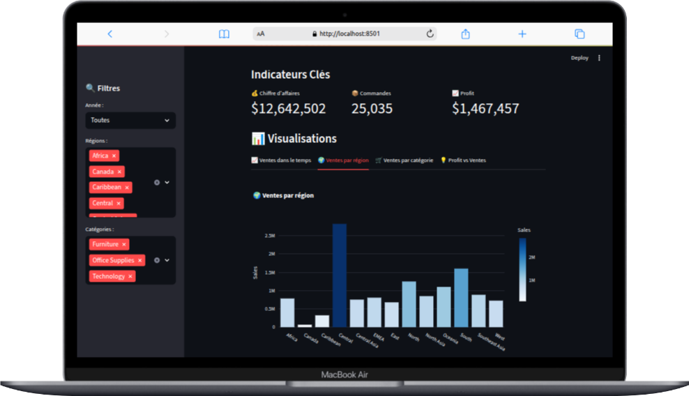

# 📊 Dashboard Commercial - Sample Superstore

Ce projet est un tableau de bord interactif réalisé avec **Python (Streamlit + Plotly)**.  
Il permet d’analyser les performances commerciales d’une entreprise à partir du dataset **Sample Superstore**.

---

## 🚀 Fonctionnalités
- Suivi des indicateurs clés (CA, profit, commandes).
- Visualisations interactives (ventes dans le temps, par région, par catégorie, relation profit/ventes).
- Exploration des top produits.
- Filtres dynamiques (année, région, catégorie).

---

## 🎯 Objectifs du projet
Ce projet simule une mission de Data Analyst dans une entreprise de retail :
- Fournir une vision claire des performances commerciales
- Identifier les régions et catégories les plus performantes
- Suivre l’évolution des ventes dans le temps
- Mettre en évidence les produits à fort potentiel

---

## 📂 Structure du projet
```
dashboard_commercial/
│── data/               # Dataset (non inclus dans GitHub, lien plus bas)
│── notebooks/          # Analyse exploratoire (EDA)
│── app/                # Code de l'application Streamlit
│── requirements.txt    # Dépendances
│── README.md           # Documentation
```

---

## 🗂️ Dataset
Le dataset utilisé est le **Sample Superstore**, disponible publiquement :  
👉 [Télécharger ici](https://community.tableau.com/s/question/0D54T00000CWe27SAD/sample-superstore-data-set)

⚠️ Le fichier n’est pas inclus dans le repo GitHub (à placer dans `/data/`).

---

## ⚙️ Installation
1. Cloner le repo :
```bash
git clone https://github.com/ThePerformer0/dashboard_commercial.git
cd dashboard_commercial
```

2. Créer un environnement virtuel :

```bash
python3 -m venv venv
source venv/bin/activate
```

3. Installer les dépendances :

```bash
pip install -r requirements.txt
```

4. Lancer l'application :

```bash
streamlit run app/app.py
```

---

## 📸 Aperçu



👉 [Accéder à la démo en ligne](https://dashboard-commercial.streamlit.app)


---

## 🧰 Outils utilisés

* **Python** : pandas, plotly, streamlit
* **Data Viz** : Plotly Express
* **EDA** : Jupyter Notebook
* **Dataset** : Sample Superstore (Tableau)

## Notes

J'ai choisi d'utiliser Streamlit car je travaille sous Linux et je n'ai pas accès à Power BI.  
Ce choix permet une grande flexibilité et une facilité de déploiement multiplateforme.
